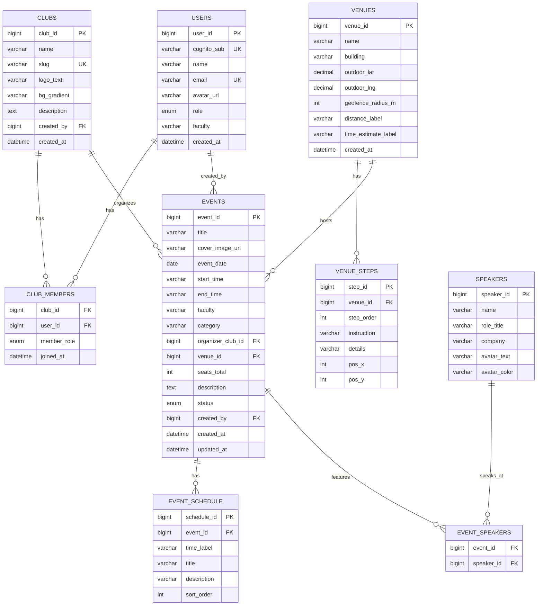

# EventTrail — Database Structure

This is the from-scratch schema for the real backend (not the demo's mocked JSON files in `src/data/`, though field names are kept consistent where sensible so the demo data can be used as seed/sample data).

**Split rationale (matches the architecture diagram):**
- **Amazon RDS (MySQL)** → relational, low-churn data: users, clubs, events, venues, speakers, schedules. Needs joins, filtering, referential integrity.
- **Amazon DynamoDB** → high-churn, high-concurrency real-time state: RSVP counts and waitlist. Needs atomic counters and sub-second read/write under concurrent load — a relational row-lock in MySQL would bottleneck under simultaneous RSVP bursts.
- **Amazon S3** → binary/static assets: event cover images, club logos, floor-plan graph JSON, uploaded venue images.

> ⚠️ Design decision: `seatsAvailable` / `rsvpCount` / `waitlistCount` are **not** stored in RDS. They live only in DynamoDB as the single source of truth, to avoid dual-write consistency bugs between two databases. The `events` table in RDS only stores `seats_total` (fixed capacity).

---

## 1. Entity-Relationship Diagram (RDS — MySQL)



---

## 2. RDS MySQL — DDL

```sql
-- ========== USERS ==========
CREATE TABLE users (
  user_id       BIGINT AUTO_INCREMENT PRIMARY KEY,
  cognito_sub   VARCHAR(64) NOT NULL UNIQUE,       -- maps to Cognito 'sub' claim
  name          VARCHAR(120) NOT NULL,
  email         VARCHAR(160) NOT NULL UNIQUE,
  avatar_url    VARCHAR(500),
  role          ENUM('student','club_admin','campus_staff') NOT NULL DEFAULT 'student',
  faculty       VARCHAR(80),                        -- e.g. Science, Arts, Engineering
  created_at    DATETIME DEFAULT CURRENT_TIMESTAMP
);

-- ========== CLUBS ==========
CREATE TABLE clubs (
  club_id       BIGINT AUTO_INCREMENT PRIMARY KEY,
  name          VARCHAR(120) NOT NULL,
  slug          VARCHAR(140) NOT NULL UNIQUE,
  logo_text     VARCHAR(4),                         -- e.g. "DX"
  bg_gradient   VARCHAR(80),                         -- tailwind gradient class pair
  description   TEXT,
  created_by    BIGINT,
  created_at    DATETIME DEFAULT CURRENT_TIMESTAMP,
  FOREIGN KEY (created_by) REFERENCES users(user_id)
);

-- ========== CLUB MEMBERS (junction) ==========
CREATE TABLE club_members (
  club_id       BIGINT NOT NULL,
  user_id       BIGINT NOT NULL,
  member_role   ENUM('member','club_admin') NOT NULL DEFAULT 'member',
  joined_at     DATETIME DEFAULT CURRENT_TIMESTAMP,
  PRIMARY KEY (club_id, user_id),
  FOREIGN KEY (club_id) REFERENCES clubs(club_id) ON DELETE CASCADE,
  FOREIGN KEY (user_id) REFERENCES users(user_id) ON DELETE CASCADE
);

-- ========== VENUES ==========
CREATE TABLE venues (
  venue_id            BIGINT AUTO_INCREMENT PRIMARY KEY,
  name                VARCHAR(160) NOT NULL,
  building            VARCHAR(160),
  outdoor_lat         DECIMAL(9,6) NOT NULL,
  outdoor_lng         DECIMAL(9,6) NOT NULL,
  geofence_radius_m   INT NOT NULL DEFAULT 60,       -- used by Haversine check on frontend/Lambda
  distance_label       VARCHAR(20),                   -- cached display label e.g. "450m"
  time_estimate_label  VARCHAR(20),                   -- cached display label e.g. "6 mins"
  created_at          DATETIME DEFAULT CURRENT_TIMESTAMP
);

-- ========== VENUE STEPS (admin-authored indoor directions) ==========
CREATE TABLE venue_steps (
  step_id       BIGINT AUTO_INCREMENT PRIMARY KEY,
  venue_id      BIGINT NOT NULL,
  step_order    INT NOT NULL,
  instruction   VARCHAR(255) NOT NULL,
  details       VARCHAR(255),
  pos_x         INT,                                  -- indoor mini-map coordinate (for StepTracker visual)
  pos_y         INT,
  FOREIGN KEY (venue_id) REFERENCES venues(venue_id) ON DELETE CASCADE,
  UNIQUE KEY uniq_venue_step_order (venue_id, step_order)
);

-- ========== SPEAKERS ==========
CREATE TABLE speakers (
  speaker_id    BIGINT AUTO_INCREMENT PRIMARY KEY,
  name          VARCHAR(120) NOT NULL,
  role_title    VARCHAR(120),
  company       VARCHAR(120),
  avatar_text   VARCHAR(4),
  avatar_color  VARCHAR(10)
);

-- ========== EVENTS ==========
CREATE TABLE events (
  event_id            BIGINT AUTO_INCREMENT PRIMARY KEY,
  title               VARCHAR(200) NOT NULL,
  cover_image_url      VARCHAR(500),
  event_date          DATE NOT NULL,
  start_time          VARCHAR(20),
  end_time            VARCHAR(20),
  faculty             VARCHAR(80),
  category            VARCHAR(80),
  organizer_club_id   BIGINT,
  venue_id            BIGINT,
  seats_total         INT NOT NULL,
  description         TEXT,
  status              ENUM('draft','published','cancelled') NOT NULL DEFAULT 'draft',
  created_by          BIGINT,
  created_at          DATETIME DEFAULT CURRENT_TIMESTAMP,
  updated_at          DATETIME DEFAULT CURRENT_TIMESTAMP ON UPDATE CURRENT_TIMESTAMP,
  FOREIGN KEY (organizer_club_id) REFERENCES clubs(club_id),
  FOREIGN KEY (venue_id) REFERENCES venues(venue_id),
  FOREIGN KEY (created_by) REFERENCES users(user_id),
  INDEX idx_events_filter (faculty, category, event_date)   -- supports discovery feed filters
);

-- ========== EVENT SCHEDULE (agenda items) ==========
CREATE TABLE event_schedule (
  schedule_id   BIGINT AUTO_INCREMENT PRIMARY KEY,
  event_id      BIGINT NOT NULL,
  time_label    VARCHAR(20),
  title         VARCHAR(160),
  description   VARCHAR(255),
  sort_order    INT NOT NULL,
  FOREIGN KEY (event_id) REFERENCES events(event_id) ON DELETE CASCADE
);

-- ========== EVENT SPEAKERS (junction) ==========
CREATE TABLE event_speakers (
  event_id      BIGINT NOT NULL,
  speaker_id    BIGINT NOT NULL,
  PRIMARY KEY (event_id, speaker_id),
  FOREIGN KEY (event_id) REFERENCES events(event_id) ON DELETE CASCADE,
  FOREIGN KEY (speaker_id) REFERENCES speakers(speaker_id) ON DELETE CASCADE
);
```

---

## 3. DynamoDB — Real-Time RSVP & Waitlist

Single-table design, table name: **`campuspulse-rsvp`**

| Attribute | Type | Notes |
|---|---|---|
| `PK` | S | `EVENT#<eventId>` |
| `SK` | S | `METADATA` \| `USER#<userId>` |
| `entityType` | S | `COUNTER` \| `RSVP` |
| `status` | S | `CONFIRMED` \| `WAITLISTED` \| `CANCELLED` (RSVP items only) |
| `seatsTotal` | N | (COUNTER item only) |
| `confirmedCount` | N | (COUNTER item only) — updated via atomic `ADD` |
| `waitlistCount` | N | (COUNTER item only) — updated via atomic `ADD` |
| `waitlistJoinedAt` | S (ISO 8601) | present only when `status = WAITLISTED` (sparse GSI key) |
| `rsvpedAt` | S (ISO 8601) | set on every RSVP item |
| `promotedAt` | S (ISO 8601) | set when a waitlisted user is promoted |

### Item shapes

**Counter item (one per event):**
```json
{
  "PK": "EVENT#hackathon-2026",
  "SK": "METADATA",
  "entityType": "COUNTER",
  "seatsTotal": 100,
  "confirmedCount": 55,
  "waitlistCount": 0
}
```

**RSVP item (one per user per event):**
```json
{
  "PK": "EVENT#pixel-craft-2026",
  "SK": "USER#student-1",
  "entityType": "RSVP",
  "status": "WAITLISTED",
  "waitlistJoinedAt": "2026-07-01T14:22:00Z",
  "rsvpedAt": "2026-07-01T14:22:00Z"
}
```

### Global Secondary Indexes

| Index | PK | SK | Purpose |
|---|---|---|---|
| `GSI1-UserRsvps` | `SK` (`USER#<userId>`) | `rsvpedAt` | "My RSVPs" — all events a student has RSVP'd/waitlisted for |
| `GSI2-WaitlistOrder` | `PK` (`EVENT#<eventId>`) | `waitlistJoinedAt` | Sparse index (only items with `waitlistJoinedAt` set) — lets the promotion Lambda `Query` the single oldest waitlisted user in O(1) instead of scanning |

### Core operations (how this satisfies the Abstract)

1. **RSVP (capacity-safe):**
   `UpdateItem` on the `METADATA` item —
   `ADD confirmedCount :1` with `ConditionExpression: confirmedCount < seatsTotal`.
   - Succeeds → write RSVP item with `status = CONFIRMED`.
   - Condition fails (event full) → `ADD waitlistCount :1`, write RSVP item with `status = WAITLISTED` + `waitlistJoinedAt = now()`.
   This is the **atomic counter** pattern the Abstract specifies for thread-safe capacity enforcement.

2. **Cancellation → auto-promotion:**
   - Update the cancelling user's RSVP item to `CANCELLED`, `ADD confirmedCount :-1` on `METADATA`.
   - DynamoDB Stream on this table triggers the **Waitlist Promotion Lambda**, which `Query`s `GSI2-WaitlistOrder` for `PK = EVENT#<id>` with `Limit(1)` (ascending by `waitlistJoinedAt`) to get the longest-waiting student.
   - Promote: set that item's `status = CONFIRMED`, `promotedAt = now()`, remove `waitlistJoinedAt` (drops it out of the sparse GSI), `ADD confirmedCount :1 / waitlistCount :-1` on `METADATA`.
   - Triggers an immediate SNS notification to the promoted student.

3. **Venue change after RSVPs confirmed:**
   `Query` all `SK = USER#*` items under `PK = EVENT#<id>` with `status = CONFIRMED` → fan-out to SNS with updated venue/indoor directions + map link.

---

## 4. Amazon S3 — Buckets & Key Layout

| Bucket | Purpose | Example key |
|---|---|---|
| `campuspulse-frontend` | React build (CloudFront origin) | `index.html`, `assets/*.js` |
| `campuspulse-media` | Event covers, club logos, user avatars | `events/hackathon-2026/cover.jpg` |
| `campuspulse-maps` | Campus path graph (nodes/edges GeoJSON) + floor overlay assets | `graph/campus-graph.json`, `floorplans/science-hall-a.json` |

> The **pathfinding graph** (`nodes`/`edges` used for outdoor route pre-computation/caching, distinct from live OpenRouteService calls) is versioned JSON in S3 rather than a DB table — it's large, rarely changes, and is read wholesale by the Maps Lambda/frontend rather than queried by key, so a DB round-trip adds no value.

---

## 5. Access Pattern Summary

| Feature | Store | Pattern |
|---|---|---|
| Event discovery feed w/ filters | RDS | `SELECT ... WHERE faculty=? AND category=? AND event_date BETWEEN ?` using `idx_events_filter` |
| Event detail (agenda + speakers) | RDS | Join `events` + `event_schedule` + `event_speakers`/`speakers` |
| Club directory / profile | RDS | `clubs` + `club_members` join |
| Live seat count on a card | DynamoDB | `GetItem PK=EVENT#<id> SK=METADATA` |
| "Is this user RSVP'd?" | DynamoDB | `GetItem PK=EVENT#<id> SK=USER#<userId>` |
| "My RSVPs" (student dashboard) | DynamoDB | `Query GSI1-UserRsvps SK=USER#<userId>` |
| Promote next waitlisted user | DynamoDB | `Query GSI2-WaitlistOrder PK=EVENT#<id> Limit(1)` |
| Indoor step-by-step directions | RDS | `SELECT * FROM venue_steps WHERE venue_id=? ORDER BY step_order` |
| Outdoor route polyline | External (OpenRouteService, not stored) + S3 graph cache | Lambda proxy call, optional cache in S3/DynamoDB |

---

## 6. Notes / Open Decisions for Later Sprints

- [ ] Confirm whether `venue_steps.pos_x/pos_y` (indoor mini-map coordinates) should instead be normalized floor-plan SVG coordinates once real floor plans are uploaded (Module 4.3).
- [ ] Consider RDS Proxy for Lambda connection pooling once concurrent event-browsing load is tested (Sprint 6 load test).
- [ ] Decide whether to cache OpenRouteService responses (e.g., in DynamoDB with a TTL) to reduce external API calls and stay within free-tier/rate limits.
- [ ] Add a `notifications_log` DynamoDB table if delivery-history/debugging visibility is needed for Module 5.1 (not required for MVP).
