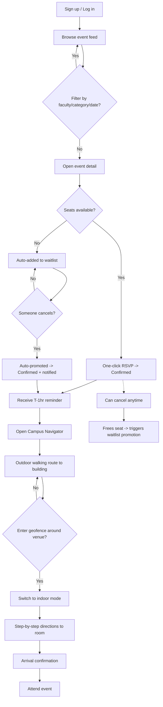
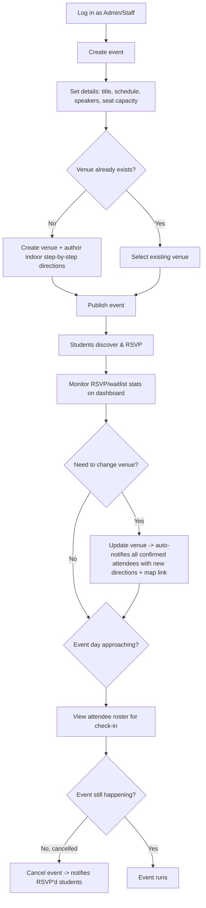

# EventTrail (CampusPulse) — Project Overview & User Flow

## What it is

**EventTrail** (working title **CampusPulse**) is a full-stack, serverless campus event and RSVP platform built on AWS. It replaces the fragmented mess of WhatsApp groups, noticeboards, and email chains that students currently rely on to find campus events, with one centralized system for **discovery, RSVP, waitlisting, and physical navigation** to the venue.

## The problem it solves

Campus events are scattered across disconnected channels, so students miss events they'd have wanted to attend, first-year students in particular end up more socially isolated, and club organizers manage registrations manually through spreadsheets with no real capacity control. On top of that, even when a student decides to attend, large or unfamiliar campuses make it genuinely hard to find the right building and room.

## What makes it different

Three things distinguish EventTrail from "just another events app":

1. **Thread-safe RSVP + automatic waitlisting** — capacity is enforced with DynamoDB atomic counters, so it never overbooks even under concurrent RSVP bursts, and when someone cancels, the longest-waiting student is promoted automatically.
2. **Dual-phase navigation** — a walking route (Leaflet + OpenRouteService) gets a student to the building outdoors, then a geofence-triggered switch to admin-authored step-by-step indoor directions gets them to the exact room, without needing floor-plan images.
3. **Proactive notifications** — SNS + EventBridge push reminders, waitlist-promotion alerts, and venue-change alerts (with the updated directions and map link included) without anyone having to manually message attendees.

## Roles

| Role | Who | Can do |
|---|---|---|
| **Student** | Any registered student | Browse/filter events, RSVP, join waitlists, join clubs, navigate to venues, receive notifications |
| **Admin / Club Organizer** | Club leadership | Everything a student can, plus create/edit/cancel events, manage their club's venues and indoor directions, view RSVP stats and rosters |
| **Campus Staff** | University staff | Same as Admin, but not tied to a specific club — manages shared campus-wide venues and can post campus-wide events |

## Core features

- Centralized, filterable event discovery feed (faculty, category, date)
- Event detail pages with agenda, speakers, and venue info
- One-click RSVP with automatic waitlisting and promotion
- "My RSVPs" student dashboard
- Club directory, profiles, and membership
- Outdoor walking navigation + indoor step-by-step directions
- Automated email/SMS reminders, promotion alerts, and venue-change alerts
- Admin dashboard: RSVP stats, attendee roster, event/venue management

---

## User Flow — Student

**Narrative version:**
1. Student signs up/logs in with campus credentials.
2. Browses the event feed, optionally filtering by faculty/category/date.
3. Opens an event's detail page to see the agenda, speakers, and venue.
4. RSVPs in one click — confirmed if seats remain, automatically waitlisted if full.
5. If waitlisted, gets automatically promoted (and notified) the moment a confirmed attendee cancels.
6. Gets a reminder notification an hour before the event.
7. Opens the Campus Navigator, which routes them outdoors to the building.
8. Crossing the geofence around the venue automatically switches the view to indoor mode.
9. Follows admin-authored step-by-step directions to the exact room, with a progress tracker.
10. Arrives — confirmation shown. Can also browse/join clubs and manage their RSVPs from a personal dashboard at any point in this flow.

---

## User Flow — Admin / Club Organizer

**Narrative version:**
1. Admin/organizer logs in and creates a new event — title, date/time, faculty/category, agenda, speakers, seat capacity.
2. Selects an existing venue or creates a new one, authoring the step-by-step indoor directions if it's new.
3. Publishes the event — it now appears in the student discovery feed with a live seat counter.
4. Monitors RSVP and waitlist numbers from the admin dashboard as students register.
5. If the venue changes, updating it automatically fans out a notification (with updated directions + map link) to everyone already confirmed — no manual messaging needed.
6. On the day, pulls the attendee roster for check-in.
7. If the event needs to be cancelled instead, cancelling notifies everyone who RSVP'd.

---

## Screens / Pages (maps to `module-details.md`)

**Student-facing:** Landing, Login/Signup, Event Discovery (feed + filters), Event Detail, Club Directory, Club Profile, RSVP Confirmation, Campus Navigator (outdoor + indoor), Student Dashboard ("My RSVPs")

**Admin-facing:** Admin Dashboard (stats + roster), Event Create/Edit Form, Venue Upload/List (indoor step authoring), Club management

---

## Tech Stack Snapshot

React.js (S3 + CloudFront) → API Gateway → Lambda → RDS MySQL (structured data) + DynamoDB (real-time RSVP state) → SNS/EventBridge (notifications), with Cognito for auth and Leaflet/OpenStreetMap/OpenRouteService for navigation. Full detail in `database.md` and `module-details.md`.
